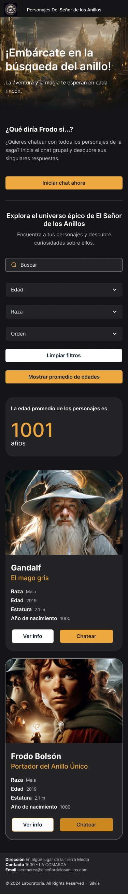
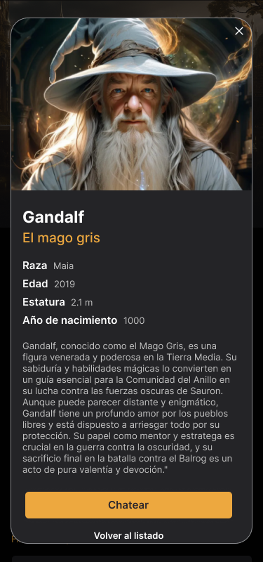
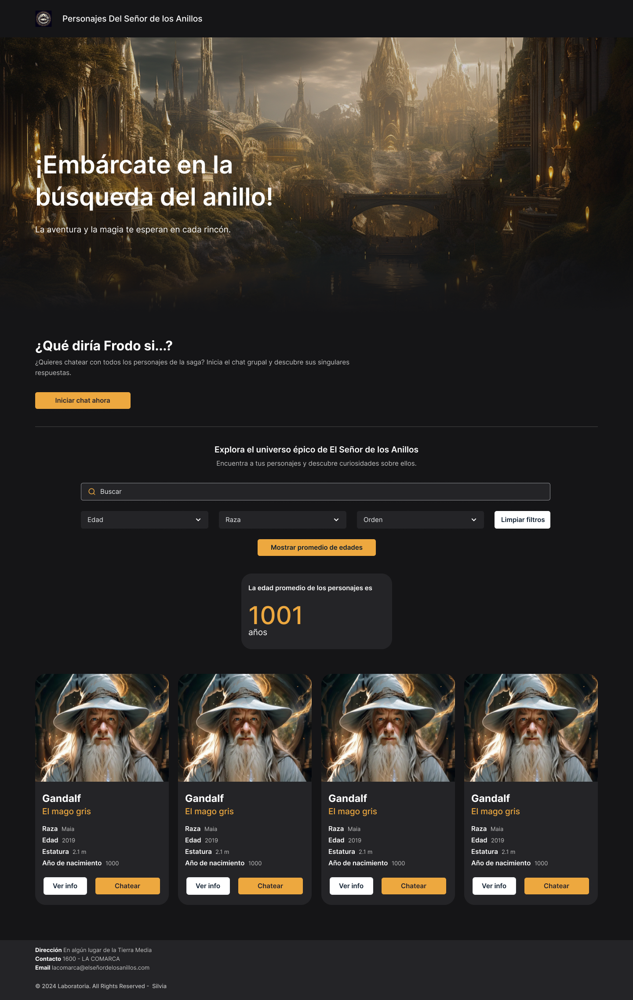
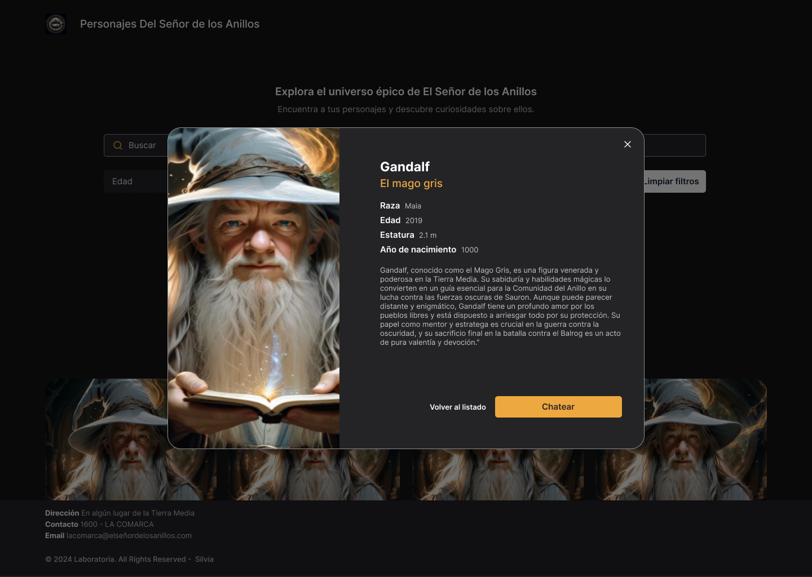
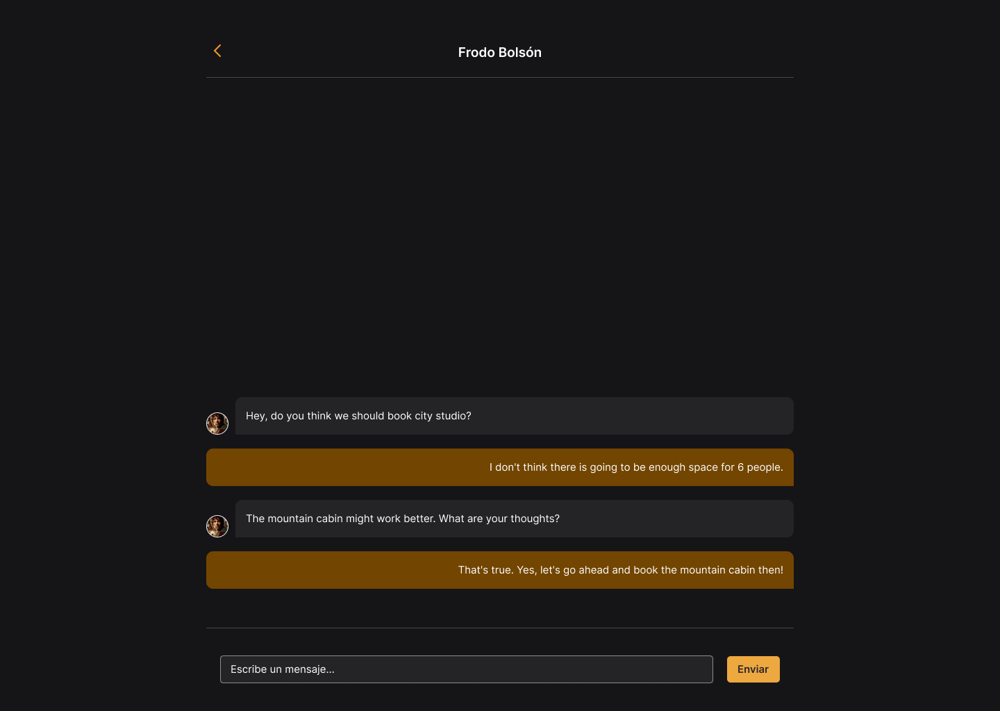

# El Chat de los Anillos

## Introducción

Bienvenid@ a El Chat de Los Anillos, una aplicación que te permite explorar y profundizar en el fascinante mundo de "El Señor de los Anillos". Aquí podrás descubrir información detallada sobre tus personajes favoritos, interactuar con ellos a través de un chat impulsado por la API de OpenAI y disfrutar de una experiencia única e interactiva. Sumérgete en este viaje épico y descubre todos los secretos de la Tierra Media.

## Índice

* [Introducción](#introducción)
* [Resumen del proyecto](#resumen-del-proyecto)
* [Definición del producto](#definición-del-producto)
* [Funcionalidades](#funcionalidades)
* [Historias de usuario](#historias-de-usuario)
* [Diseño de la interfaz de usuario](#diseño-de-la-interfaz-de-usuario)
  * [Prototipo de baja fidelidad](#prototipo-de-baja-fidelidad)
  * [Prototipo de alta fidelidad - Mobile](#prototipo-de-alta-fidelidad---mobile)
  * [Prototipo de alta fidelidad - Desktop](#prototipo-de-alta-fidelidad---desktop)
* [Testeos de usabilidad](#testeos-de-usabilidad)
* [Responsividad](#responsividad)
* [Cierre del Proyecto](#cierre-del-proyecto)

## Resumen del proyecto

En este proyecto, se ha creado una Single Page Application (SPA) centrada en los personajes del universo de "El Señor de los Anillos". Además de tener funcionalidades de visualización, filtrado, ordenamiento y cálculo de estadísticas sobre sus datos, se ha añadido una nueva vista para consultar información detallada de cada personaje y la posibilidad de interactuar con ellos a través de un sistema de chat.

**Objetivos generales:**
- Desarrollar una Single Page Application (SPA).
- Aplicar los conceptos de responsividad en el desarrollo de las vistas.
- Implementar un router para la navegación entre las diferentes vistas de la aplicación.
- Integrar una API externa (OpenAI).
- Entender la asincronía en JavaScript.
- Crear una suite de pruebas unitarias que permitan testear código asíncrono.

**Tecnologías utilizadas:** JavaScript (ES6), HTML, CSS.

**Herramientas Adicionales:** Jest, utilizado para el desarrollo de pruebas unitarias en JavaScript, garantizando la calidad y robustez del código al verificar su funcionamiento y rendimiento.

Estos lenguajes y herramientas han permitido crear una aplicación web completa y funcional, con un diseño atractivo y una experiencia de usuario optimizada.

### Entregable final:
- Single Page Application (SPA) responsive.
- Implementación de múltiples vistas.
- Sistema de enrutamiento para la navegación dentro de la aplicación.
- Carga dinámica de cada vista mediante JavaScript.
- Actualización de la URL y el título del documento según la vista cargada.
- Funcionalidades de: visualización, filtrado, ordenamiento y cálculo estadístico.
- Redirección a una vista con información detallada al hacer clic en una tarjeta de personaje.
- Configuración de la API Key para interactuar con la API de Open AI.
- Interacción con un personaje a través de un chat individual o con todos los personajes a la vez a través de un chat grupal utilizando la API de Open AI.

### Definición del producto
El producto está diseñado para brindar una experiencia intuitiva y eficiente a los usuarios, permitiendo explorar y obtener información detallada sobre los personajes del Señor de los Anillos de manera interactiva y atractiva.

## Funcionalidades
1. **Visualización de Datos:** Muestra detallada de cada personaje, incluyendo su nombre, descripción, imagen y datos clave como raza, edad, estatura y año de nacimiento.
2. **Filtrado:** Permite filtrar los personajes por raza y edad.
3. **Ordenado:** Posibilidad de ordenar los personajes de forma ascendente o descendente según el nombre.
4. **Cálculo Estadístico:** Calcula el promedio de edad de los personajes con datos de edad conocidos.
5. **Interacción:** Interactuar con uno o todos los personajes a través de un chat. 

### Historias de usuario
**Historia 1:**
- Como usuario, quiero poder visualizar la información de los personajes en la pantalla principal.
  - Definición de terminado: La información se muestra claramente con opciones de filtrado y ordenamiento.
  - Criterios de aceptación: Se puede ver la lista completa de personajes con opciones de filtrado y ordenamiento.

**Historia 2:**
- Como usuario, quiero poder ingresar mi API Key para interactuar con la API de Open AI.
  - Definición de terminado: Se proporciona un input tipo modal para ingresar la API Key.
  - Criterios de aceptación: El usuario puede ingresar su API Key y confirmar su configuración.

**Historia 3:**
- Como usuario, quiero ver una página con más detalles de cada personaje.
  - Definición de terminado: Se implementa una vista detallada para cada personaje.
  - Criterios de aceptación: Al hacer clic en una tarjeta de personaje en su botón "Ver Info", se abre un modal con información detallada.

**Historia 4:**
- Como usuario, quiero poder interactuar con uno o todos los personajes a través de un chat.
  - Definición de terminado: Se integra un sistema de chat, tanto individual como grupal impulsado por la API de Open AI.
  - Criterios de aceptación: Se puede iniciar una conversación interactiva con uno o todos los personaje y obtener respuestas informativas y personalizadas.

### Diseño de la interfaz de usuario
La interfaz está diseñada para ofrecer una experiencia intuitiva y atractiva para los usuarios que deseen explorar el mundo de "El Señor de los Anillos". 

#### Prototipo de baja fidelidad
- Iteraciones de bocetos realizados utilizando papel y lápiz, tanto de la interfaz como de los modales para la API Key.
- 
- 

#### Prototipo de alta fidelidad - Mobile
- Diseño de la interfaz de usuario realizado utilizando Figma, tanto de la página principal, los modales, y la vista de los chats.
- 
- 
- 
- 

#### Prototipo de alta fidelidad - Desktop
- Diseño de la interfaz de usuario realizado utilizando Figma, tanto de la página principal, los modales, y la vista de los chats.
- 
- 
- 

---
Con estos prototipos, se logró diseñar una interfaz atractiva y funcional brindando una experiencia de usuario enriquecedora para los fans de "El Señor de los Anillos".

### Testeos de usabilidad
- Se realizaron tests de usabilidad con distintos usuarios y se iteró en los diseños en base a los resultados obtenidos.

# Responsividad
El diseño de la aplicación se ha desarrollado teniendo en cuenta la importancia de la responsividad, asegurando una experiencia óptima para los usuarios en diferentes dispositivos y tamaños de pantalla. Algunas de las características de la responsividad incluyen:

- **Diseño adaptable:** Los elementos de la interfaz se ajustan de manera dinámica para garantizar una visualización adecuada en dispositivos móviles, tabletas y computadoras de escritorio.
- **Uso de Media Queries:** Se ha implementado Media Queries para aplicar estilos específicos según el tamaño de la pantalla, optimizando la presentación de la información y la navegación.
- **Pruebas en Dispositivos Variados:** Durante el desarrollo, se realizaron pruebas exhaustivas en una variedad de dispositivos y resoluciones para verificar la compatibilidad y asegurar una experiencia uniforme.

La responsividad es una parte integral del enfoque de diseño y desarrollo, brindando a los usuarios la flexibilidad para acceder y utilizar la aplicación de manera cómoda y efectiva en cualquier dispositivo.

## Cierre del Proyecto
Hemos llegado al final de nuestro emocionante viaje por El Chat de Los Anillos, el universo de "El Señor de los Anillos".
Quiero agradecer a todas las personas que han explorado este fascinante mundo a través de esta aplicación. Este proyecto ha sido un trabajo gratificante, donde cada línea de código y cada diseño ha sido creado con dedicación y pasión por ofrecer una experiencia única.

Espero que disfruten de su experiencia en El Chat de Los Anillos y que se sumerjan aún más en las maravillosas historias y personajes de "El Señor de los Anillos". 
Gracias por ser parte de este viaje conmigo.

